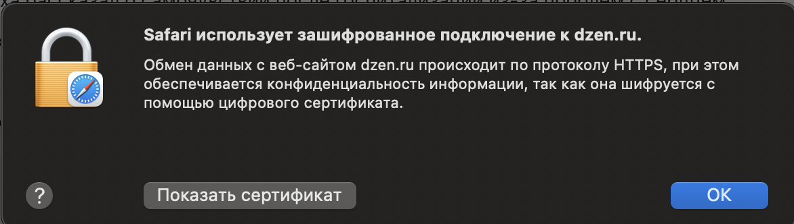

1. Сайт yandex.ru работает на защищенном протоколе, как видно на скриншоте
(https и сам браузер сигнализирует об этом)

2. структура сайта вполне стандартная: имеется поисковая строка (header) c логотипом, затем слева имеется окно виджетов, под пунктом 3 - окно популярных запросов, 4 - дополнительный виджет с погодой, 5 - раздел статей (является основным). До футера долистать не смог к сожалению, ибо там бесконечный подбор статей, которые могут быть мне интересны.
3. При помощи инструмента разработчика внес ряд изменений, которые продемонстрированны на снимках. Среди них: изменил размер текста; перекрасил цвета букв, логотипов виджетов (слева); удалил отдельные виджеты и элементы виджетов (солнышко из виджета погоды); увеличил размер открытой строки поиска, поменял название города в разделе 'Погода'. Спасибо за внимание! Надеюсь вы поставите зачет
